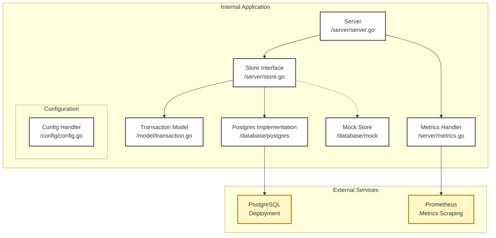

# transaction-store

## How to run

### Get up and running quickly with docker compose

Run:
```
docker-compose up --build
```
This will spin up the server as well as a postgres instance. You can then send requests to the server like so:
```
$ curl -X POST localhost:8080/api/transaction/ -d '{"transactionId":"0f7e46df-c685-4df9-9e23-e75e7ac8ba7a","amount": "99.99","timestamp":"2009-09-28T19:03:12Z"}'
{"id":"0f7e46df-c685-4df9-9e23-e75e7ac8ba7a","status":"success"}
```
or check the server's health:
```
$ curl localhost:8080/health
{"status":"healthy"}
```
### Deploy application into Kubernetes cluster

The application can be deployed into a local k3d cluster using the supplied Makefile. First, provision a k3d cluster:
```
make provision-cluster
```
then to deploy the application:
```
make deploy-application
```
The server application will take 40s or so to come up while it waits for the database to be ready.

To tear down the cluster, run:
```
make destroy-cluster
```
Requests can be sent to the server as before, but first you will need to port-forward the server deployment like so:
```
kubectl port-forward deployment/server 8080 > /dev/null &
```
A Grafana dashboard is deployed alongside the application. To access the dashboard, you can port-forward the Grafana deployment:
```
kubectl port-forward svc/grafana 3000 > /dev/null &
```
The Grafana instance will then be available at http://localhost:3000. To see the dashboard, open the side menu and click on `Dashboards`, you should then see a dashboard called `Transaction server metrics`.

To generate some load on the server, there is a utility script at the root of the repo that sends requests in an infinite loop. To run it, run:
```
./load-generator.sh <request interval in seconds>
```

#### Components

### The server

The server provides a REST API that accepts a request with the following format:
```
{
    "transactionId": "0f7e46df-c685-4df9-9e23-e75e7ac8ba7a",
    "amount": "99.99",
    "timestamp": "2009-09-28T19:03:12Z"
}
```
The server application code is split into the following packages:
- `server` - houses the HTTP handlers. There are endpoints for processing transaction requests, health checks, and scraping metrics. The server package also defines an interface for the database operations, so that any database implementation can be swapped in. The server package is also where metrics are collected for scraping later by Prometheus.
- `config` - contains the configuration for the server. The logging verbosity can also be set here. The config is defined in `config.yaml`, which lives at the root of the repo.
- `database` - contains the code for interacting with the database. For this project I chose to use a postgres database for simplicity, so the database package makes use of the github.com/jackc/pgx/v5/pgxpool library for connecting to the postgres instance.
- `model` - defines the main `Transaction` type which is common to most of the packages. This allows a common type to be passed and keeps the dependency tree simple.
- `main.go` - glues everything together. Following the priniple of dependency-injection, the various components of the system (logger, database implementation) are initialised here, before being passed into the server package.

### Docker image

The Docker image for the server is built using the Dockerfile in the root of the repo. The docker file makes use of a multi-stage build. In this case, the dependencies are built first, and so do not need to be built on subsequent builds unless they have changed. Keeping the run part separate from the build stage also means we don't have to bring the build components into the final image, and can instead use a lightweight image based on alpine.

### CI/CD

For CI/CD, I used GitHub Actions. There is an action for building, testing, and pushing the docker image to the Github Container Registry. I would have liked to have had an action for deploying the built image to an environment but unfortunately ran out of time.

### Terraform

The k3d cluster is provisioned using Terraform. The Terraform files are in terraform/k3d/. There is also some dummy Terraform in terraform/aws/ which meant to serve as a rough outline of how a similar cluster might be set up in AWS.

### Observability

For observability I chose to use Prometheus and Grafana. These are both deployed into the observability namespace.

### Security considerations

Security hardening steps I took:
- Set SecurityContext in K8s manifests
- Set up NetworkPolicies for ingress and egress
- Set up docker file to run as a non-root user

### System architecture


